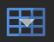

# Adding Images

## Load the 360°-images

To begin, we’ll load the four 360°-images of **Waikumete Cemetery** into the project. We can do this two ways:

1. Click the **input** icon ({width="25"}) in the top-left toolbar. When the file selection dialog box appears, navigate to the tutorial files, select all four images, and click `Open`.

2. Select all four images in your file browser (outside of the application) and drag them directly into the Pano2VR window.

## Level the 360°-images

While Pano2VR does automatically level images, they can still sometimes appear tilted or skewed, depending on the angle of the tripod was on when the image was captured and the complexity of the terrain. This can be fixed by manually leveling the image.

To show the automatic alignment to equitorial level, press the `L` key.

To manually adjust the level of image:
- hold down the `L` key and left click to drag the image into level.
- the location of the cursor marks the fulcrum of the levelling rotation. 
- clicking on the centre vertical red line moves the horizon up and down (use the arrow keys for finer control).

Once the image has been relevelled, rotate the image horizontally (east or west) and press `L` again to recheck the level from a new angle. Repeat this process as needed. Some images may require trial and error to find a level that feels balanced from all directions.

!!! tip "Pro tip"
    Aligning the image to clear visual references, such as buildings, the horizon, or any other vertical or horizontal features can improve accuracy.

!!! success "Grid lines"     
    Grid lines should appear automatically once the images are loaded. However, if they are not visible, click the grid icon ({width="25"}) at the bottom of the image to toggle the grid lines on.