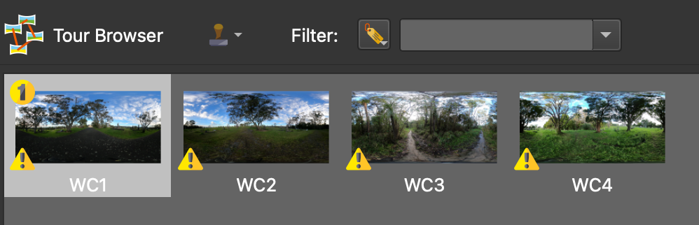
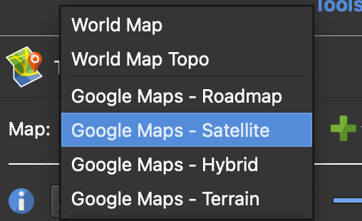
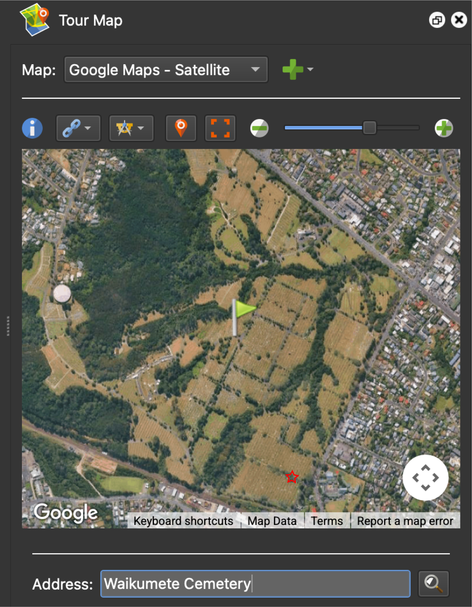
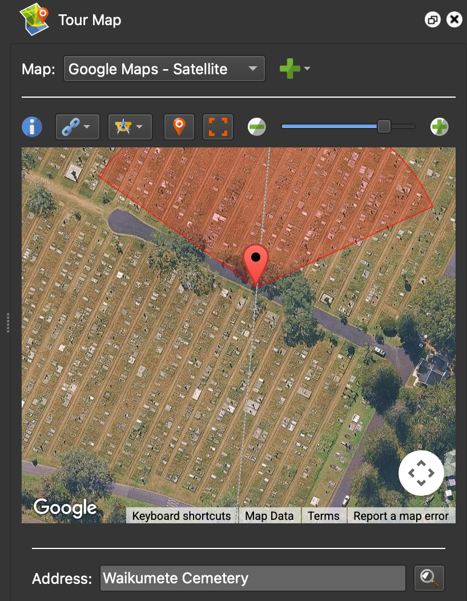
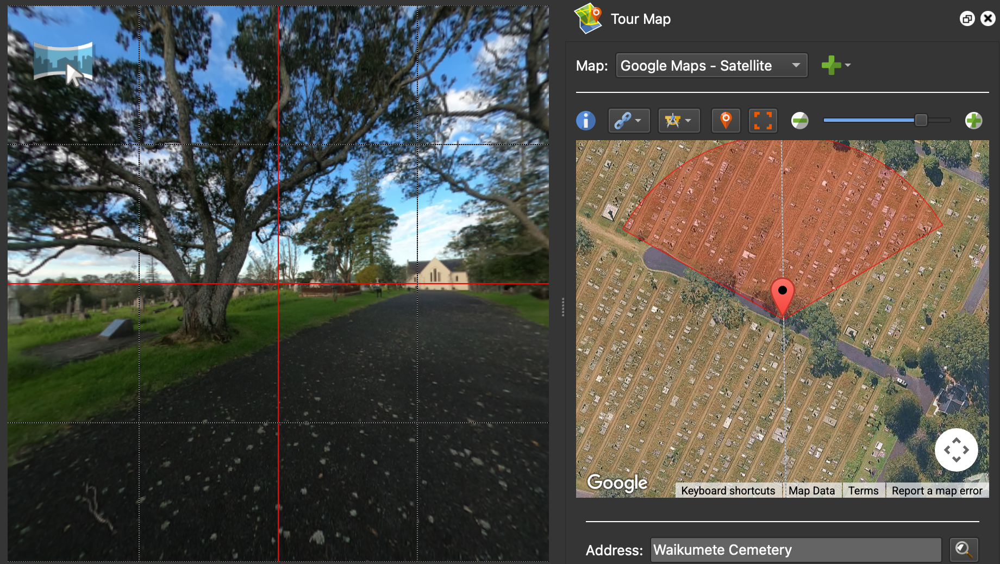
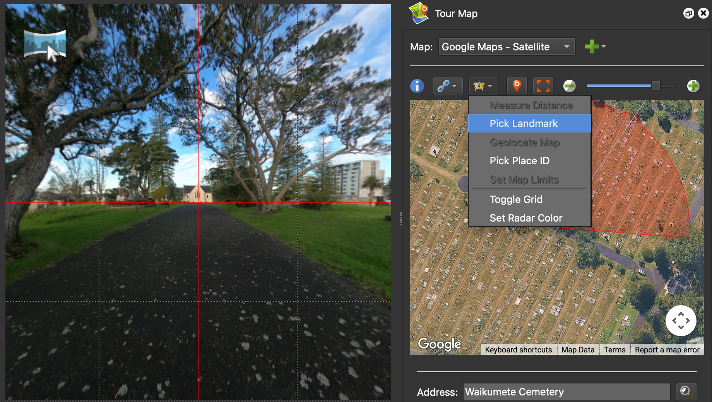
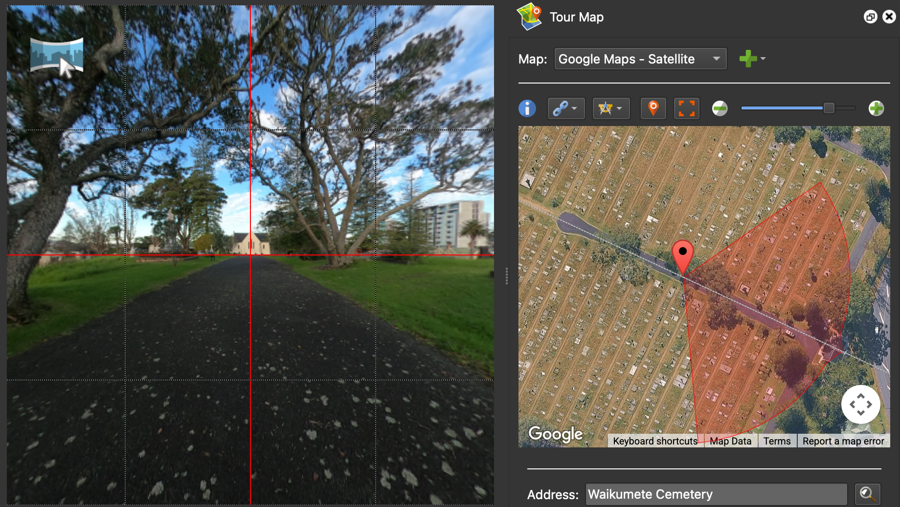

# Adding Images

## Load the images

The first step when building a virtual trip is to load the 360° images into the project. This tutorial contains four 360° images of *Waikumete Cemetery*. The images can be loaded two ways:

- **Option 1**: Click the **input** icon ({width="25"}) in the top-left toolbar. When the file selection dialog box appears, navigate to the tutorial files, select all four images, and click `Open`.  

- **Option 2**: Select all four images in your file browser (outside of the application) and drag them directly into the Pano2VR window.

The images should now appear in the tour browser panel at the bottom of the screen.

!!! info "Tour Browser"     
    If the Tour Browser panel isn't already be open (or if it is accidentally closed), it can be reopened by clicking on the **Tour Browser** icon ({width="20"}) in the *Edit* toolbar, or using the menubar by clicking `Window` → `Tour Browser`.

!!! tip "Pro tip"
    Pano2VR defaults to displaying the original image description at the time of capture, rather than the filename of the image. The image description can be modified using the exiftool package in the command line.

## Add or modify the geolocation of the images

Some images will already have GPS information embedded, while others (like the *Waikumete Cemetery* images) will not. Regardless, it is a good idea to confirm that the geolocation information is correct. 

To add geolocation information:

- **Select the image in the Tour Browser panel**: For this example, select *WaikumeteCemetery1*.JPG (WC1).   

- **Open the Tour Map**: Click on the **Tour Map** icon ({width="25"})to open the tour map panel.  

 - **Switch the map view to Google Maps - Satellite**: The default map view is the World Map, but this won't provide enough detail to precisely identify the locations where the image were taken. In the `Map` field, toggle from *World Map* to *Google Maps - Satellite*. 
 
    {width="200"}

- **Search for the address**: Enter the address or name of the location where the photo was taken into the `Address` field type. 

    In this example, type *Waikumete Cemetery* into the `Address` field. Press enter or click the magnifying glass icon to search. A green flag will be dropped in the middle of Waikumete Cemetery.
    
    

- **Manually update the location of the image**: The address search drops a green flag in the vacinity of where the image was taken, but it doesn't provide the precise location -- the actual location where the image was taken is marked with the red star on the image above. 

    To manually refine the location, zoom in to the location marked by the red star on the image above and double click. Once the red pin appears, it can be moved by either dragging the pin or nudging it with the arrow keys.

    

## Orient the images

Once the geolocation pin is in the correct position, the next step is to orient the image. The red semicircle extending for the pin should match the orientation visible on the 360° image. However, in this example, the 360° image facing down the road, while the pin is N facing away from the road.

Pano2VR uses landmarks to help reorient images. To do this:

- **Find a landmark that is visible in both the image and the map.** In this example, the church is the landmark.  
- **Align the landmark in the centre of the image** by clicking and dragging until it is centred in the crosshairs of the red grid lines.  
- **Select *Pick Landmark* from the Tools icon.**  
      
-  **Double-click on the landmark in the Tour Map.** In this example, double-click on the church at the end of the road.  
    

The image view should now align with the map orientation. Navigate around the 360° image to make sure that the **Tour Map** view correctly follows the movements.

!!! info "Grid lines"     
    Grid lines should appear automatically once the images are loaded. However, if they are not visible, click the grid icon ({width="25"}) at the bottom of the image to toggle the grid lines on.
    
## Level the 360° images

While Pano2VR does automatically level images, they can still sometimes appear tilted or skewed, depending on the angle of the tripod was on when the image was captured and the complexity of the terrain. This can be fixed by manually leveling the image.

To show the automatic alignment to equitorial level, press the `L` key.

To manually adjust the level of image:
- hold down the `L` key and left click to drag the image into level.
- the location of the cursor marks the fulcrum of the levelling rotation. 
- clicking on the centre vertical red line moves the horizon up and down (use the arrow keys for finer control).

Once the image has been relevelled, rotate the image horizontally (east or west) and press `L` again to recheck the level from a new angle. Repeat this process as needed. Some images may require trial and error to find a level that feels balanced from all directions.

!!! tip "Pro tip"
    Aligning the image to clear visual references, such as buildings, the horizon, or any other vertical or horizontal features can improve accuracy.