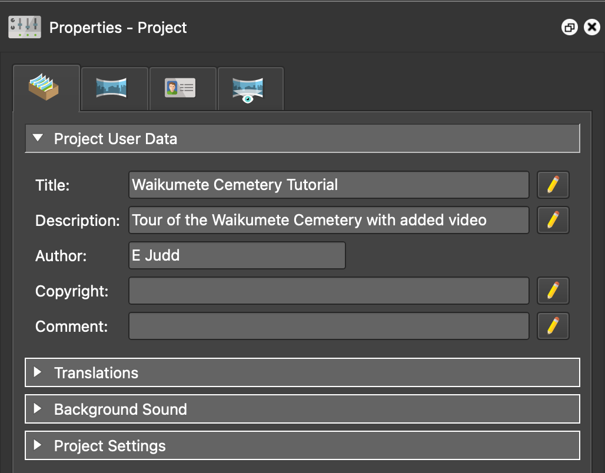

# Getting Started

## Download the tutorial files

To follow along with this tutorial, download the tutorial files from the project repository on GitHub.
!!! info "Download Tutorial Files"
    [Click here to download the tutorial files from GitHub](https://github.com/ejjudd/Pano2VR/Tutorials)

These files include sample 360° images and videos from Waikumete Cemetery.

## Create a New Project

1. Open the **Pano2VR** application.

2. Start a new project  
   &nbsp;&nbsp;&nbsp;&nbsp; Click `File` → `New Project`

3. Fill in the **Project User Data** in the **Properties** panel  
   &nbsp;&nbsp;&nbsp;&nbsp; Add project title, description, and author  
   &nbsp;&nbsp;&nbsp;&nbsp;  
   &nbsp;&nbsp;&nbsp;&nbsp; 

4. Save the project as **Waikumete Cemetery Tutorial**  
   &nbsp;&nbsp;&nbsp;&nbsp; Click `File` → `Save As...`