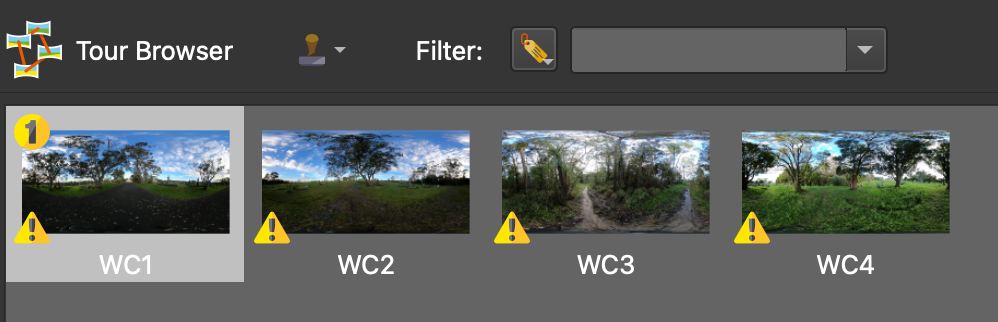
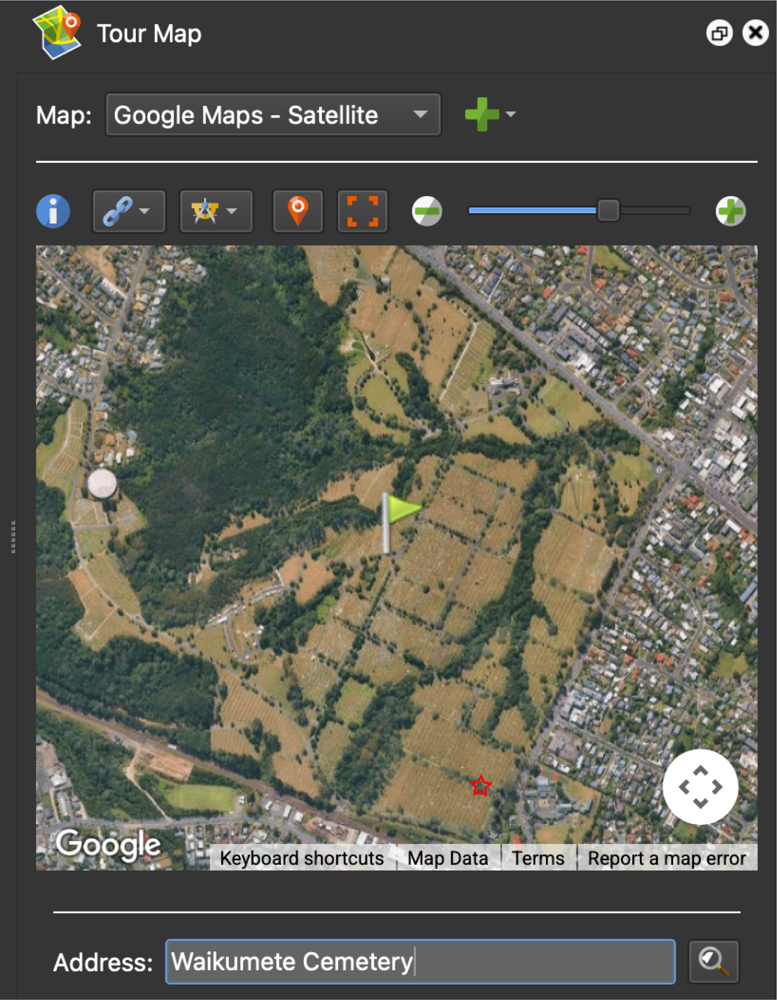
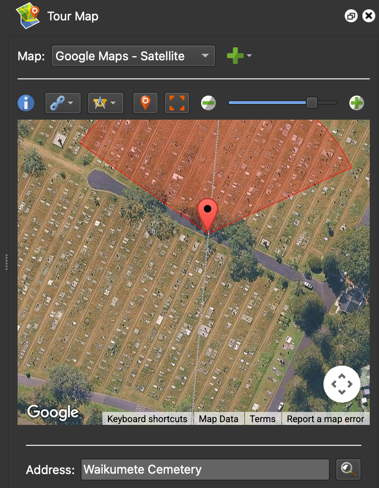
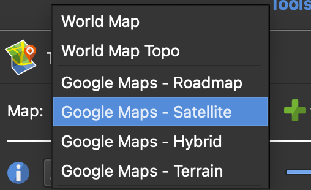
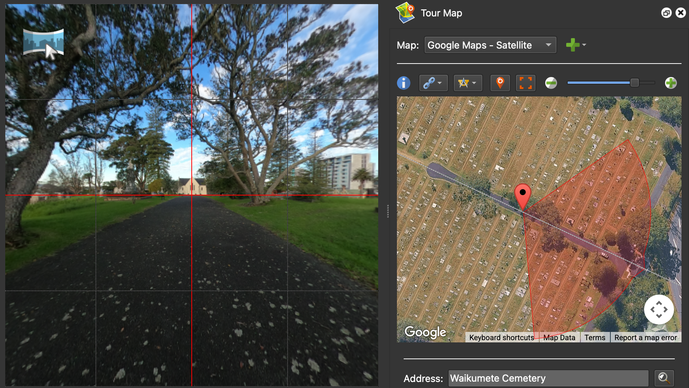
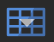

# Adding Images

## Loading images

The first step when building a virtual trip is to load the 360° images into the project. There are two ways to load images:

- **Option 1**: Click the **input** icon ({width="25"}) in the top-left toolbar. When the file selection dialog box appears, navigate to the tutorial files, select all four images, and click `Open`.

- **Option 2**: Select all four images in your file browser (outside of the application) and drag them directly into the Pano2VR application.

!!! abstract "Follow along"
    This tutorial contains four 360° images of *Waikumete Cemetery*. Add the four images using one of the options above. Once added, the images should now appear in the tour browser panel at the bottom of the screen.
    
    

   
    If the Tour Browser panel isn't already be open (or if it is accidentally closed), it can be reopened by clicking on the **Tour Browser** icon ({width="20"}) in the *Edit* toolbar, or using the menubar by clicking `Window` → `Tour Browser`.

!!! tip "Pro tip"
    Pano2VR defaults to displaying the original image description at the time of capture, rather than the filename of the image. The image description can be modified using the [exiftool](https://exiftool.org/) package in the command line.

## Adding or modifying the geolocation of the images

Some images will already contain GPS information embedded in their metadata, while others will not. Regardless, it is always a good idea to confirm that the geolocation information is correct. 

To add geolocation information:

- Select the image in the **Tour Browser** panel.

- Click the **Tour Map** icon ({width="25"})to open the tour map panel.

- Enter the address where the photo was taken into the `Address` field. A green flag will be dropped at this location.

- Confirm or refine the location:
    - If the green flag is placed correctly, click on it to drop a red pin should appear and confirm the location.
    - If the green flag is *not* placed correctly, navigate to the correct location and double-click to drop a red pin. 
    
    Once the red pin appears, its placement can be further refined by either dragging the pin or nudging it with the arrow keys. 

!!! abstract "Follow along"
    To assign geolocation information for *WaikumeteCemetery1.JPG* (WC1):

    - Select the image in the **Tour Browser** panel.
    - In the `Address` field, type *Waikumete Cemetery*. Press enter or click the magnifying glass icon to search. A green flag will be dropped in the middle of Waikumete Cemetery. 
    - Manually update the location of the image. 
        - The exact location where *Waikumete Cemetery 1* was taken is marked with the red star on the lefthand image below. 
        - Zoom in to this location and double-click to drop the red pin. 
        - If necessary, refine the placement by dragging the pin or nudging it with the arrow keys. The location of the pin should match the righthand image below.

    {width=49%}!{width=49%}!

!!! tip "Pro tip"
    {width=25%, align=right}The default basemap is the *World Map*. In some situations, this map may not provide enough detail to precisely identify where an image was taken. Use the `Map` field to toggle between different basemap options, such as *World Map Topo* or *Google Maps – Satellite*.

    

## Orienting the images

Once the geolocation pin is in the correct position, the next step is to orient the image. The red semicircle extending for the pin should match the orientation visible on the 360° image. 

Pano2VR uses landmarks to help reorient images. To do this:

- Find a landmark that is visible in both the image and the map.
- Align the landmark in the centre of the image by clicking and dragging until it is centred in the crosshairs of the red grid lines.
- Select *Pick Landmark* from the Tools icon.
- Double-click on the landmark in the Tour Map.

!!! abstract "Follow along"
    We'll use the church as the landmark to orient the *WaikumeteCemetery1* image:

    - Roate the 360° image until the church is centred in the crosshairs of the red grid lines.
    - Select *Pick Landmark* from the Tools icon.
    -  Double-click on the church at the end of the road in the Tour Map.

    

    The image view should now align with the map orientation. Navigate around the 360° image to make sure that the **Tour Map** view correctly follows the movements.

!!! danger "Troubleshooting"    
    Grid lines should appear automatically once the images are loaded. However, if they are not visible, click the grid icon ({width="25"}) at the bottom of the image to toggle the grid lines on.
    
## Leveling the images

While Pano2VR does automatically level images, they can still sometimes appear tilted or skewed, depending on the angle of the tripod was on when the image was captured and the complexity of the terrain. This can be fixed by manually leveling the image.

To show the automatic alignment to equitorial level, press the `L` key.

To manually adjust the level of image:
- hold down the `L` key and left click to drag the image into level.
- the location of the cursor marks the fulcrum of the levelling rotation. 
- clicking on the centre vertical red line moves the horizon up and down (use the arrow keys for finer control).

Once the image has been relevelled, rotate the image horizontally (east or west) and press `L` again to recheck the level from a new angle. Repeat this process as needed. Some images may require trial and error to find a level that feels balanced from all directions.

!!! warning "Follow along"
    The *Waikumete Cemetery* images are mostly level, but follow the steps above to see if the leveling can be improved further. Try to find a level that works in all directions.

!!! tip "Pro tip"
    Aligning the image to clear visual references, such as buildings, the horizon, or any other vertical or horizontal features can improve accuracy.