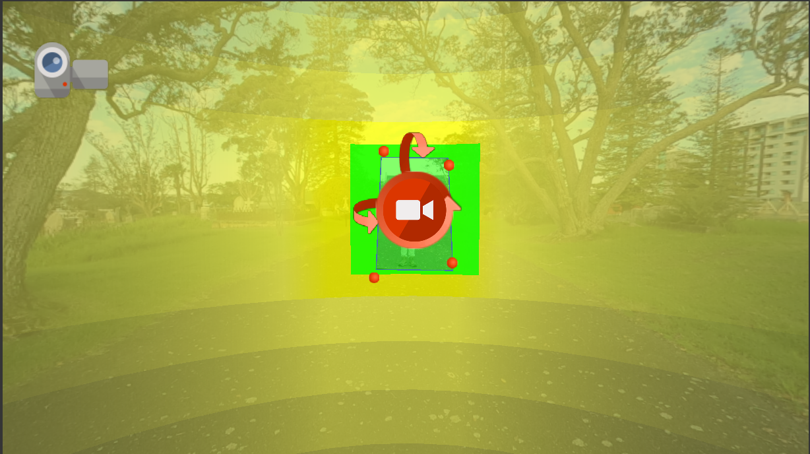
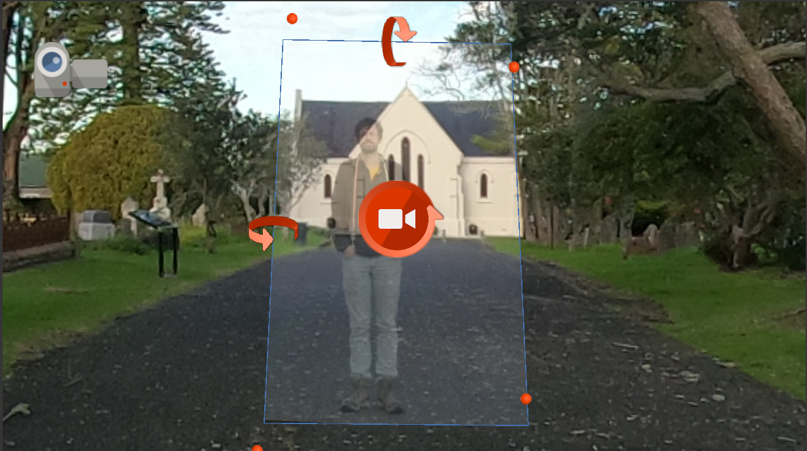

# **Adding Video**

There are several ways to add video to a virtual field trip in Pano2VR. This tutorial covers four different methods:

- **Option 1**: Pinning video within the panorama
- **Option 2**: Adding video as a hot spot  
- **Option 3**: Embedding video with patches
- **Option 4**: Adding video in the skin or UI overlay

!!! download "System requirements"
    Before beginning this tutorial, FFmpeg must be installed and the file path to the FFmpeg executable must be specified within Pano2VR’s Preferences/Settings. If you have not already done this, follow the instructions in the [Getting Started](getting-started.md) page.

---
## **Pinning a video**
A pinned video is placed directly into the 360° image and appears as a patch (i.e., the video will cover whatever part of the 360° image is behind it).

<table class="full-width-table">
  <tr>
    <td>
      <strong>Pros</strong>
      <ul>
        <li>Visually integrates videos into the 360° image</li>
        <li>Highly visible (i.e., easy for users to engage with)</li>
        <li>Can auto-play or respond to user interaction</li>
      </ul>
    </td>
    <td>
      <strong>Cons</strong>
      <ul>
        <li>Requires careful positioning, scaling</li>
        <li>Require pre-processing of the video (e.g., color correction)</li>
        <li>Can appear unpolished if the video is not well integrated</li>
      </ul>
    </td>
  </tr>
  <tr>
    <td>
      <strong>Applications</strong>
      <ul>
        <li>Adding a speaker or guide directly into the field trip</li>
        <li>Showing activity at a location (e.g., a person demonstrating something)</li>
      </ul>
    </td>
    <td>
      <strong>Customizations</strong>
      <ul>
        <li>Playback behavior (e.g., autoplay, loop, manual start)</li>
        <li>Sound mode (e.g., static, directional)</li>
        <li>Click behavior (e.g., pop out, play/pause)</li>
        <li>Placement, size, rotation</li>
      </ul>
    </td>
  </tr>
</table>

### **Step 1**: Add the video
There are two ways to add a pinned video:

- **Option 1**: In the 
Viewer Panel
  
    
  
, open 
View Modes
  
    
  
and select 
Video Mode
  
    
  
, or press the `V` key on the keyboard. Double-click on the general location where you want the video to appear within the image. A dialog box will pop up. Navigate to the video and click `Open`.
- **Option 2**: Drag the video file directly from your file browser into the Viewer Panel
  
    
  
.
!!! try "Give it a try!"
    In this example, we’ll add *WC1_Video.mp4* to *WaikumeteCemetery1.JPG*. The video was taken in front of the church and aligns with the default view. 
    
    Before adding the video, right-click in the Viewer and select `Go to Default View`. Then add the video using either of the options above

### **Step 2**: Add a Preview Frame

After adding the video, Pano2VR will prompt you to generate a preview image. This is a static preview that will appear before the video loads or plays.

Pano2VR can generate a preview automatically using FFmpeg, or you can provide your own preview image. 

!!! try "Give it a try!"
    Select `Yes` when prompted: `Would you like Pano2VR to create a preview file for you?`
    
    A dialogue box will appear. Name the preview file (e.g., *WC1_Video_Preview*) and select a location for it (e.g., the same folder as the tutorial videos).
    
!!! trouble "Troubleshooting"
    If the `Would you like Pano2VR to create a preview file for you?` prompt does not appear or if an error occurs, double-check that FFmpeg is installed and that the file path to the executable is correctly entered in Pano2VR’s settings. See the [Getting Started](getting-started.md) page for more details.

### **Step 3**: Modify the video properties

The video properties will automatically appear in the Properties Panel
  
    
  
when the video is selected. There are several properties which can be viewed and/or modified. For a full list, see the [Pano2VR video properties documentation](https://ggnome.com/doc/pano2vr/workspace/viewer-modes/videos-props/). Here we will only modify a few properties:

- **ID**: Each video element is given a unique ID. The default is *Element01*. The number will increase with each added element.

    !!! try "Give it a try!"
        Rename the ID to: *Video01*.

- **File**: This shows the path to and filename of the video. The video can be swapped out at anytime for another video by clicking on the **folder** icon ({width="25"})

- **Mode**: This field refers to the sound mode. There are six sound modes:
    
    - **Static**: the audio will play uniformly in all directions.
    - **Surround**: the audio will play in all directions, but the sound channels will automatically adjust to match the perspective.
    - {width=50%, align=right}**Directional Rectangular** (*default mode*): the audio will play at maximum level when centred on the field (green rectangle) and gradually fade out following the rectangular sound field (yellow). 
    
        The *Horizontal*, *Vertical*, and *Field* sizes can also be adjusted in the Properties Panel
  
    
  
.

    - **Directional Circular**: the audio behaves the same as in the **Directional Rectangular** mode but uses a circular sound field.
    - **Effect Rectangular**: the audio will only play within the rectangular sound field (green rectangle).
    - **Effect Circular**: the audio will only play within the circular sound field (green circle).
    !!! try "Give it a try!"
        Select the `Static` sound mode.

- **Loop**: This field can be modified to change the number of times the video repeats its playback. There are several options:
    - **-1**: the video will not play until it is activated by a click (or another action specified in the Skin Editor)
    - **0**: the video will play on a continuous loop
    - **1** (*default loop*): the video will play once
    - **Any positive integer**: plays the video that number of times (e.g., entering `4` will loop the video four times).
    !!! try "Give it a try!"
        Change the *Loop* value to **-1**, which will require the video playback to be activated by a click.    

- **Click Mode** This field specifies what will happen when a user clicks on the video. There are  from the following options:

    - **None**: nothing happens.
    - **Play/Pause**: clicking will start and stop the video.
    - **Pop out original**: clicking will enlarge the video to its original dimensions and begin playing.
    - **Pop out fit**: clicking will enlarge the video to fit the window and begin playing.
    !!! try "Give it a try!"
        Change the *Click Mode* to **Play/Pause**, which means that clicking will start or stop the vide playback.    

### **Step 4**: Resize the video

When the video is selected in the Viewer, you should see the preview image when the video is selected in the Viewer. Use the control handles to adjust its placement and rotation:

- **Move**: Click the center handle to reposition the video in the panorama.
- **Resize**: Drag the red corner handles to scale the video and match the surrounding environment.
- **Rotate Horizontally**: Click and drag the top arrow in a vertical motion.
- **Rotate Vertically**: Click and drag the left arrow in a vertical motion.
- **Spin**: Click and drag the center rotation arrow vertically to rotate the video around its own axis.

!!! try "Give it a try!"
    Resize the video using the church as a guide. Zoom in to the video get a better view. Drag the red corner handles to align the roof, bottom, and windows of the church in the video to their position within the 360° image. 
    

!!! protip "Pro tip"     
    The yellow and green sound fields can make it difficult to resize and position videos accurately.

    Regarless of which sound mode is ultimately used, temporarily switching to the `Static` mode can make it easier to properly align the video.

### **Step 5**: Output and test

Once the video is pinned and configured, output the trip to test the results and make sure the video behaves as expected. To output the trip:

- Navigate to the Output panel. If it is not already open, click on the **Output** icon ({width="25"}).
- Click on the green plus icon ({width="25"}) to add an output and choose `Web`.
- Pano2VR will automatically create an output folder in the same folder that the project is saved. Optionally, the output folder path can be manually selected by clicking on the **Folder** icon ({width="25"}) next to `Output Folder`.
- Click on the **Generate Output** icon ({width="25"}).
- Once the output is generated, the trip should automatically open in your default internet browser.

!!! protip "Pro tip"     
    The yellow and green sound fields can make it difficult to resize and position videos accurately.

    Regarless of which sound mode is ultimately used, temporarily switching to the `Static` mode can make it easier to properly align the video.

---
## **Adding video as a hotspot**
A video hotspot triggers a video to play when the user clicks on an icon (or *hot spot*) within the 360° image. The video is not visible until activated.

<table class="full-width-table">
  <tr>
    <td>
      <strong>Pros</strong>
      <ul>
        <li>Keeps the panorama visually clean and uncluttered</li>
        <li>Gives users control over when the video appears</li>
        <li>Easier to position since video isn't embedded</li>
      </ul>
    </td>
    <td>
      <strong>Cons</strong>
      <ul>
        <li>Less immediately noticeable (i.e., users might miss it)</li>
        <li>Adds an extra step before the video is seen</li>
        <li>Can feel less immersive than pinned or embedded videos</li>
      </ul>
    </td>
  </tr>
  <tr>
    <td>
      <strong>Applications</strong>
      <ul>
        <li>Providing optional or supplemental content</li>
        <li>Linking to explainer videos or background information</li>
        <li>Reducing visual load in busy scenes</li>
      </ul>
    </td>
    <td>
      <strong>Customizations</strong>
      <ul>
        <li>Hotspot style, size, and appearance</li>
        <li>Trigger behavior (e.g., click, hover)</li>
        <li>Video playback settings (e.g., pop-up size/position)</li>
        <li>Tooltip text or hover info</li>
      </ul>
    </td>
  </tr>
</table>
