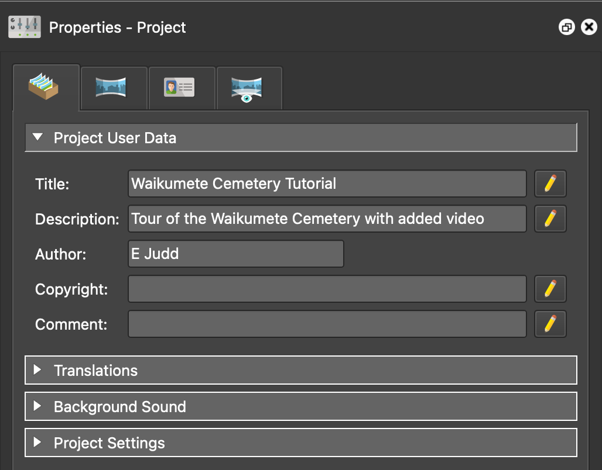

---
hide:
  - toc
---

# Getting Started

## Prerequisites

To follow along with these tutorials, you'll need:

!!! download "Pano2VR"

      A trial version can be downloaded [here](https://ggnome.com/pano2vr/#downloads). The trial version includes all of the same features as the licensed version, with two differences: (1) only four images can be imported into a project, and (2) the output will include a watermark. Since these tutorials use only four images, the trial version is sufficient.

!!! download "FFmpeg"  

      FFmpeg is a free open-source software suite that integrates with Pano2VR. Certain video features used in this tutorial require that FFmpeg is (1) installed and (2) the file path to the FFmpeg executable is specified in Pano2VR’s Preferences. See the [Pano2VR FFmpeg documentation](https://ggnome.com/doc/pano2vr/glossary/ffmpeg/) for installation and configuration instructions.

!!! download "Tutorial files""
      
      Downloaded the tutorial files from the project repository on GitHub. These files include sample 360° images and videos captured at *Waikumete Cemetery* in Glen Eden, Auckland. They will be used throughout the tutorial examples. [Click here](https://github.com/EJJudd/Pano2VR/tree/main/Tutorials) to download the tutorial files from GitHub.

## Create a New Project

{width=35%, align=right}To create a new project in Pano2VR:

1. **Open Pano2VR**.

2. **Start a new project**.  
   &nbsp;&nbsp;&nbsp;&nbsp; Click `File` → `New Project`

3. Fill in the **Project User Data** in the **Properties** panel  
   &nbsp;&nbsp;&nbsp;&nbsp; Add project title, description, and author  

4. Save the project  
   &nbsp;&nbsp;&nbsp;&nbsp; Click `File` → `Save As...`